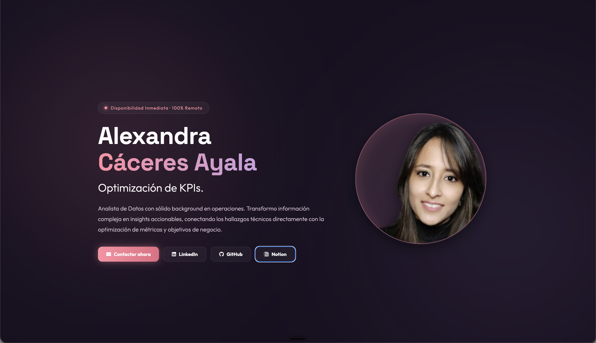
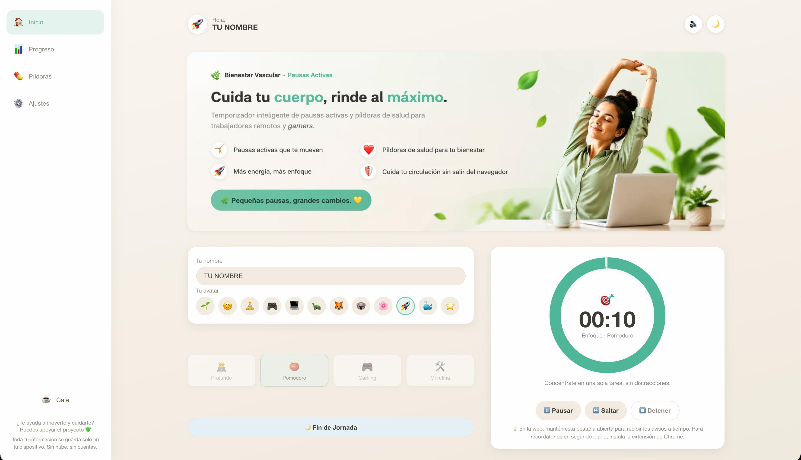
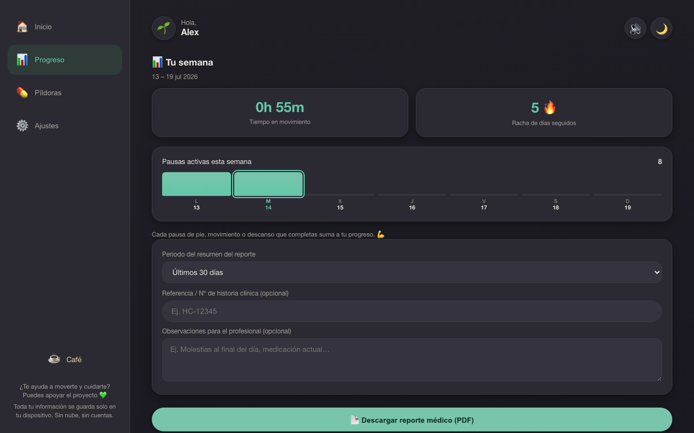

  <h1>📊 Alexandra Cáceres — Portafolio de Analítica de Datos</h1>
  

    
  

  
<em>Del dato crudo al dashboard, entendiendo el negocio detrás de cada métrica.</em>

  
  
  
  

 

## 👩🏻‍💻 Sobre este repositorio

Este repositorio aloja el código fuente de mi portafolio: el sitio donde presento mis proyectos de datos y mi trayectoria profesional.

Analista de Datos con SQL, Python y Power BI. Transformo datos en información clara y visualizaciones que facilitan la toma de decisiones. Mi experiencia de casi cuatro años en operaciones —producción, atención al cliente y retail— me permite comprender el contexto del negocio detrás de cada métrica.

> **Estado:** Disponibilidad Inmediata · 100% Remoto 🌍

---

## 🛠️ Stack Técnico y Herramientas

**Análisis de datos**

**Flujo de trabajo**

---

## 🚀 Análisis en Acción

### 🔭 EVOLUCIÓN · Observatorio del Ecosistema del Dato

**[Ver la web](https://alexandra-caceres-ayala.github.io/evolucion/)** · [Repositorio](https://github.com/Alexandra-Caceres-Ayala/evolucion) · [Newsletter semanal en LinkedIn](https://www.linkedin.com/build-relation/newsletter-follow?entityUrn=7485707534079672322)

Plataforma editorial que documenta a diario, en español, la evolución del ecosistema del dato. Funciona como un pipeline automatizado de extremo a extremo: cada mañana un agente de IA en modo desatendido redacta el boletín, lo sube mediante la API de GitHub y GitHub Actions reconstruye y publica el sitio en GitHub Pages, sin pasos manuales. El panel de menciones y tendencias por herramienta se genera con pandas y Altair, y el sitio incluye buscador, RSS y modo claro/oscuro.

Concebí el producto, defino su línea editorial y dirijo su desarrollo apoyándome en IA generativa.

  

`Markdown` · `Python` · `pandas` · `Altair` · `GitHub Actions` · `GitHub Pages` · `IA generativa`

---

### 🌿 Bienestar Vascular · Pausas Activas

**[Extensión en la Chrome Web Store](https://chromewebstore.google.com/detail/bienestar-vascular-%C2%B7-paus/bhgkbamkgopclojoicpfomlejjdjbjip)** · [App web](https://alexandra-caceres-ayala.github.io/bienestar-vascular-pausas-activas/) · [Repositorio](https://github.com/Alexandra-Caceres-Ayala/bienestar-vascular-pausas-activas)

Herramienta de pausas activas para quienes pasan el día frente a la pantalla, publicada y aprobada en la Chrome Web Store y disponible también como app web instalable. Registra la actividad diaria y las rachas, y exporta los datos en CSV/PDF para analizarlos después en Excel o Power BI. Toda la información se guarda solo en el dispositivo —sin cuentas ni servidores— y está disponible en español e inglés.

La concebí y la llevé a producción, apoyándome en IA generativa para la implementación del código.

  
  

`IA generativa` · `Local Storage API` · `Export CSV/PDF` · `Chrome Web Store`

---

### 🎯 Fever-Lens · Pipeline de datos end-to-end

[Documentación en Notion](https://www.notion.so/PROYECTOS-POWERBI-360690ad9fd180e699d1c6a4dac3bc7d?source=copy_link)

Análisis de punta a punta sobre datasets de comportamiento de usuario en eventos masivos: prototipé la lógica de negocio (ROAS y CPA) en Google Sheets, uní 2,3 millones de filas con SQL, analicé correlaciones y construí un modelo de ocupación en Python, y cerré con un dashboard en Power BI sobre un modelo dimensional en estrella.

`Google Sheets` · `SQL` · `Python` · `Power BI` · `AWS Cloud`

---

## 🧩 Cómo está construido este portafolio

Sitio estático en HTML, CSS y JavaScript, con Chart.js para el radar de proyectos y tsParticles para el fondo animado, publicado en GitHub Pages. Los proyectos se definen en una única lista dentro del código, que genera automáticamente el filtro, el radar y los iconos del stack. Construido apoyándome en IA generativa.

## 💼 ¡Conectemos!

Siempre estoy abierta a conversar sobre nuevas oportunidades, proyectos de datos o sobre cómo optimizar los procesos de tu negocio a través de la analítica.

- 📧 **Envíame un correo:** [alexandraaca7@gmail.com](mailto:alexandraaca7@gmail.com)
- 👔 **Conéctate conmigo en LinkedIn:** [Alexandra Cáceres Ayala](https://linkedin.com/in/alexandra-caceres-ayala)
